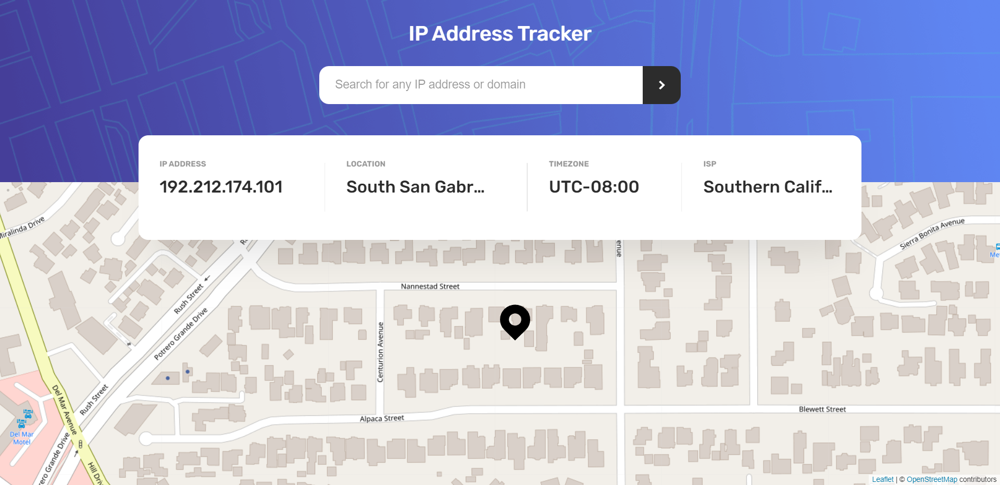

# 🤖 IP Address Tracker
IP Address Tracker Challenge from Frontend Mentor

## 🖼️ Screenshots



## 🚀 Usage

Clone and run the Repository

## Installation

### First clone the repository form GitHub:
```shell
git clone https://github.com/JoseLuria/ip-address-tracker.git 
```

### Then install the dependencies:
```shell
npm install
```

#### Finally, start the server with the following command:
```shell
npm run dev
```

## Built with 

- [React](https://reactjs.org/)
- [Styled Components](https://styled-components.com/)
- [Vite](https://vitejs.dev/)

## License

[MIT](https://opensource.org/licenses/MIT)